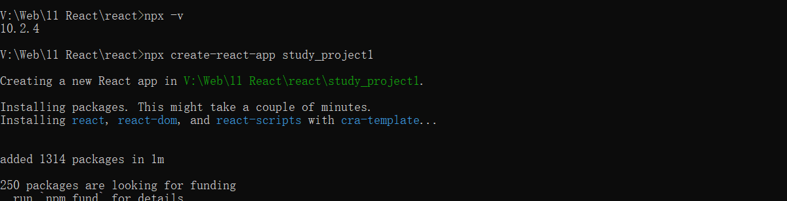
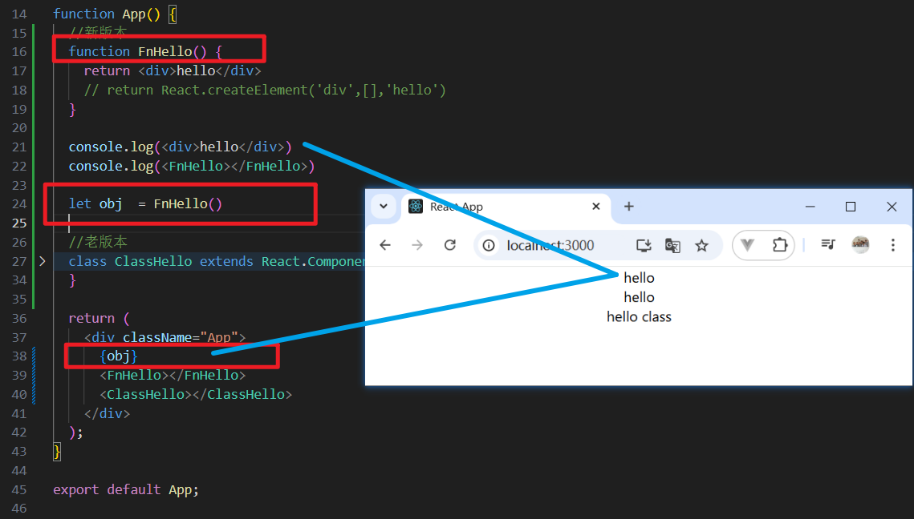

# 核心

项目目录、JSX、条件、循环、父子通信、生命周期、事件、Hook、测试、源码原理

# 创建项目


- 官方

```
npx -v

npx create-react-app study_project1(任意项目名)

cd study_project1
npm start

最后在local:3000查看
```





## 核心库

- react 

  React核心库，提供react的个个功能

- React-dom

  提供一些dom操作方法用于把react创建出来的react对象挂载到真正
  的htmldom中，或者从htmIdom中卸载。核心作用类似于vue的mount。

在index.js中可以看到。


# 组件&JSX

## JSX

组件化开发

一个组件需要包括：HTML模板，数据和方法

### react组件分类

- 函数组件（新版本）-注意要大写
- class组件（老版本）


```jsx
import logo from './logo.svg';
import './App.css';
import React from 'react';

function App() {
  //新版本
  function FnHello() {
    return <div>hello</div>
  }
  
  //老版本
  class ClassHello extends React.Component {
    constructor(props) {
      super(props)
    }
    render() {
      return <div>hello class</div>
    }
  }

  return (
    <div className="App">
      <FnHello></FnHello>
      <ClassHello></ClassHello>
    </div>
  );
}

export default App;

```


### jsx特点

直接js中混用：React项目利用babel做了对js的编译，所以我们是可以直接在is里写
jsx的

写法接近js：Jsx几乎和js一样，不同点就在于，可以更方便的写html在js里，写在
js里的html最后会被编译成一个js对象，我们也可以用react自带的createElement创建这个对象

jsx和react是独立的，不一定要在react中用jsx（react中的createElement可以实现），jsx也不一定只能用在react中

```jsx
 function FnHello() {
    // return <div>hello</div>
    return React.createElement('div',[],'hello') //元素，属性，
  }

console.log(<div>hello</div>)
console.log(<FnHello></FnHello>)
```

- 打印测试

```jsx
console.log(<div>hello</div>)
console.log(<FnHello></FnHello>)

为什么打印了四次？因为严格模式多打印了一次
```


### jsx本质


### 案例(重要)

> 目的是为了明白其本质

区分函数和组件：首字母是否大写。

不管是类组件`class ClassHello`还是函数组件`function FnHello`, 归根结底都只是一个普通类 OR 普通方法，所以可以直接调用类组件

- `function FnHello`



- 本质

FnHello本质是一个函数，但是调用它OR加尖括号，会转换成react element


## {单花括号}


注意，只能渲染element对象，不能渲染对象【与vue的不同】

# 事件绑定

## 规则

1. 类似原生  on+方法名（首字母大写）
2. 一定要赋值给事件一个方法

```jsx
import './App.css';
import React from 'react';

class App extends React.Component {
  f1() {
    console.log(222);
  }
  render() {
    return <div className='App'>
      <div onClick={()=>{  console.log(111);  }}>  111 </div>
      <div onClick={this.f1}>222</div>
    </div>
  }
}

export default App;
```

